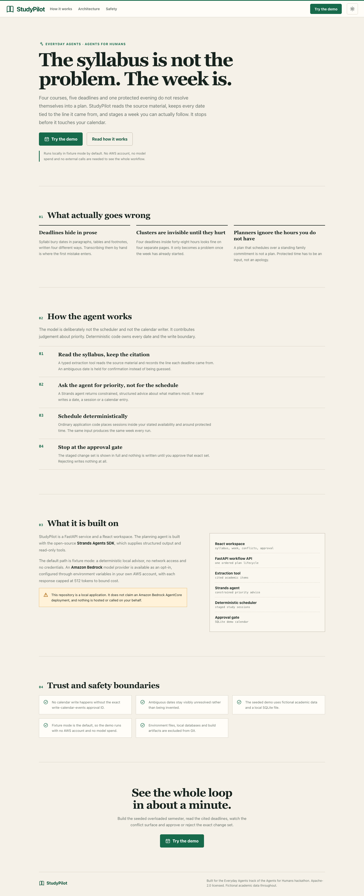
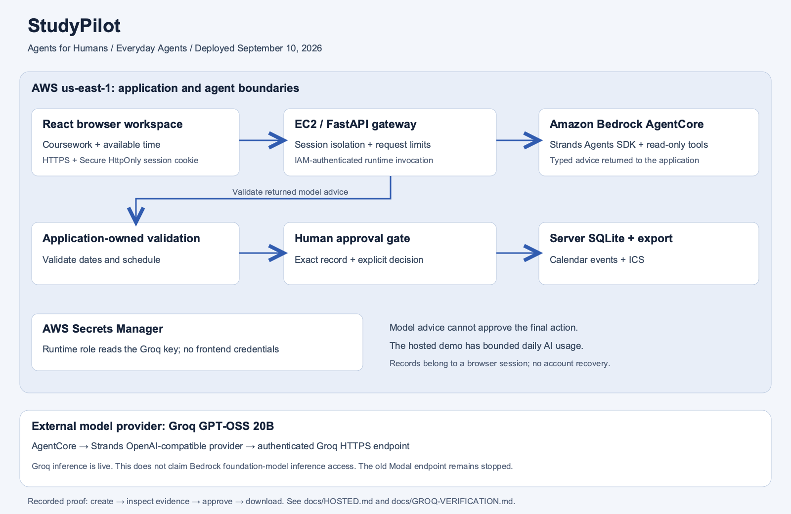

# StudyPilot

[Open the hosted app](https://studypilot.34-233-68-117.sslip.io/#overview) · [Judge access and limits](docs/HOSTED.md)

[Groq + AgentCore setup](docs/GROQ-AGENTCORE.md) · [Verified cloud workflow](docs/GROQ-VERIFICATION.md) · [Submission checklist](docs/RELEASE-CHECKLIST.md) · [Judging evidence](docs/JUDGING.md)

For the real-input, local-first workspace and its verified limits, see [Local product workflow](LOCAL-PRODUCT.md).

StudyPilot turns confirmed coursework and available study hours into a weekly plan. It preserves source references, protects unavailable time, stages calendar changes for review and can reschedule a missed session before its deadline.

Built for the **Everyday Agents** track of the Agents for Humans hackathon using the [Strands Agents SDK](https://strandsagents.com/).



## Why it exists

Students need a way to fit competing deadlines into time they actually have. StudyPilot makes that tradeoff visible before they approve a schedule. Its structured intake and line-based syllabus parser are not a general PDF or natural-language syllabus reader.

## What works

- Enter your coursework, effort estimates, study windows and protected time, or load a labeled sample.
- Preserve unresolved deadlines until you confirm a date; do not schedule those items prematurely.
- Review sessions, cited inputs and deadline clusters before writing to the local calendar.
- Approve an exact plan and download an ICS file. There is no Google or Outlook connection.
- Reschedule a missed session only when another slot fits before its deadline.
- Reopen a saved plan and revise its inputs as a new proposal. The original and its calendar events remain unchanged.
- Use the scripted Strands provider without an AWS account, or explicitly select Bedrock or OpenAI-compatible advice.

## One-command judging demo

Prerequisites: Python 3.11+, uv, Node.js 20.19+ (22.12+ recommended), npm and Git.

```bash
python3 scripts/demo.py
```

Open `http://127.0.0.1:8000`. This installs locked dependencies, builds the frontend, and serves the UI and API from one local process. It forces scripted fixture mode even if your environment enables AWS, uses temporary demo data, and removes that data when stopped with Ctrl+C. First-time dependency installation needs internet access; the demo itself does not call a model. Use `--port 8201` to avoid a port conflict. After installation, `--skip-install` reuses dependencies.

This command runs the scripted model. The real application workflow through
AgentCore, Strands and Groq GPT-OSS 20B passed on September 10; see
[the evidence](docs/GROQ-VERIFICATION.md). The earlier Qwen endpoint on Modal
remains stopped. The free scripted command does not demonstrate live inference.

## Real model setup

The backend supports explicit Bedrock, AgentCore, or OpenAI-compatible configuration,
with no silent fallback to fixtures. Use [Groq on AgentCore](docs/GROQ-AGENTCORE.md)
for the verified cloud route, or [external model configuration](docs/EXTERNAL-MODELS.md)
for direct inference. The model probe below tests direct inference; use the workflow
smoke check to verify a configured AgentCore runtime.

After configuring the ignored `backend/.env`, run:

```bash
backend/.venv/bin/python scripts/run.py check
backend/.venv/bin/python scripts/model_probe.py --allow-paid-requests --warm-only
backend/.venv/bin/python scripts/model_workflow_smoke.py --allow-paid-requests
backend/.venv/bin/python scripts/run.py serve --port 8000 --allow-paid-requests
```

The last three commands require an available funded endpoint. Do not run them against a deliberately stopped service or put provider credentials in the frontend. Judges can use the [hosted application](docs/HOSTED.md) without supplying credentials; hosted AI has bounded daily allowances.

## Architecture



[Editable SVG](docs/architecture-hosted.svg). Use this hosted-architecture PNG for the submission attachment. Older diagrams document earlier provider configurations.

```text
React planning workspace
        |
        v
FastAPI workflow API
        |
        +--> syllabus extraction tool --> cited academic items
        |
        +--> Strands planning agent ----> structured priority advice
        |        (fixture by default; Bedrock or external model is opt-in)
        |
        +--> deterministic scheduler ---> staged study sessions
        |
        +--> exact approval gate -------> SQLite demo calendar
                                             |
                                             +--> in-place missed-session replan
```

The LLM is deliberately not the scheduler or the calendar writer. Strands supplies constrained priority advice. Deterministic code validates dates, enforces availability and protected time and owns the write boundary.

Valid advice changes task order when that order fits. If it cannot fit, the scheduler tries deadline/weight order and records the fallback in plan activity. If neither attempt fits, no plan is saved. This is a bounded scheduling strategy, not a proof of globally optimal packing. Repeated task titles remain separate coursework occurrences.

## Run locally

Prerequisites: Python 3.11+, [uv](https://docs.astral.sh/uv/) and Node.js 20+.

```bash
git clone https://github.com/himanshu748/studypilot.git
cd studypilot

cd backend
uv sync --frozen --dev
STUDYPILOT_FIXTURE_MODE=true uv run uvicorn app.main:app --reload --host 127.0.0.1 --port 8000
```

In a second terminal:

```bash
cd frontend
npm ci
npm run dev -- --host 127.0.0.1 --port 5178
```

Open `http://127.0.0.1:5178`. The Vite proxy targets port 8000. This command forces local fixture mode and writes only to an ignored SQLite file.

## Optional Bedrock-backed advice

The backend reads `backend/.env`; it does not automatically load a root `.env`. Configure a Bedrock model that your AWS account can access, or set these variables in the API process environment:

```dotenv
STUDYPILOT_FIXTURE_MODE=false
STUDYPILOT_AWS_REGION=us-east-1
BEDROCK_MODEL_ID=your-model-id
AWS_PROFILE=your-profile
```

Verify current model access and pricing before enabling live mode. The response-token limit is not an account-wide spend cap, and promotional credits do not guarantee that a bank account cannot be charged.

AWS usage may incur charges. Fixture mode provides offline development and testing.
The verified AgentCore deployment hosts the Strands advisory step with Groq;
the calendar, approval gate and database remain in the application.

## Verification

```bash
cd backend
uv run pytest -q
uv run ruff check .

cd ../frontend
npm test -- --run
npm run build
```

The decisive API test proves the safety invariant across the whole workflow:

```text
create plan -> 0 calendar events
exact approval -> 8 calendar events
miss a session with time available -> still 8 events, one rescheduled
no suitable time before deadline -> conflict response, calendar unchanged
```

The suites also cover real-input validation, fragmented study windows, atomic approvals, saved-plan revision and retry/cancel behavior. Use the commands above to check your checkout; historical counts in older screenshots are not current results.

Real running-app captures: [desktop landing page](docs/screenshots/landing-desktop.png), [mobile landing page](docs/screenshots/landing-mobile.png), [desktop weekly plan](docs/screenshots/desktop-plan.png), and [mobile weekly plan](docs/screenshots/mobile-plan.png). The landing page was checked at 390, 768, and 1440 pixel widths with no horizontal overflow; the mobile planning capture retains all four cited course sources.

## Hackathon technology and outstanding requirements

All configured modes use the Strands Agents SDK tool loop. The local fixture demo uses a
scripted provider. The real AgentCore → Strands → Groq workflow passed, including
plan creation and calendar approval. Public full-app hosting and credential-free judge access
are verified with bounded allowances. See [hosted access](docs/HOSTED.md).

The [hosted architecture PNG](docs/architecture-hosted.png) documents the deployed build. The [narrated hosted walkthrough](https://youtu.be/MQl8zq_YT_A) is public on YouTube. The final Devpost submission and optional Builder article publication remain separate, unverified steps.

## Repository map

```text
backend/app/agent/       Strands agent and orchestration boundary
backend/app/planning/    deterministic conflict, scheduling and replanning logic
backend/app/storage/     SQLite plan and demo-calendar persistence
backend/app/tools/       cited syllabus extraction
frontend/src/features/  syllabus, weekly plan, conflict and approval surfaces
fixtures/                reproducible overloaded-semester syllabus
docs/design/             original interface concept
docs/screenshots/        verified running-app captures
```

## Safety and privacy

- No calendar write occurs without the exact `write-calendar-events` approval ID.
- Ambiguous dates remain visibly unresolved.
- The seeded demo uses fictional academic data.
- Local database files, environment files and build artifacts are excluded from Git.
- No AWS credentials are stored in the repository.

## Built with Codex

This solo project was designed, implemented and tested with Codex as a development collaborator. Codex helped turn the product concept into constrained agent boundaries, tests, a responsive interface and reproducible documentation; all submission claims remain tied to checked-in code or verified behavior.

## License

Apache-2.0. See `LICENSE`.
